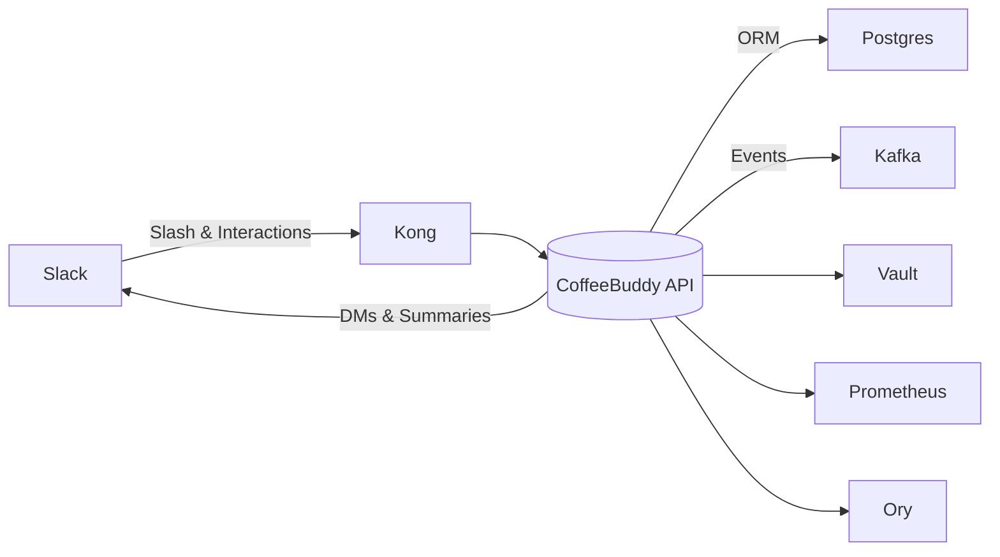

# FINALIZE
  

## Overview
CoffeeBuddy is an on-prem Slack bot that orchestrates coffee runs end-to-end: slash command initiation, interactive order capture, fair runner assignment, reminders, and admin governance. It runs entirely inside the enterprise Kubernetes perimeter and integrates with Postgres, Kafka, Kong, Ory, Vault, and Prometheus.

## Architecture


## Repository Layout
- `src/coffeebuddy/api/slack_runs`: Slash command + interaction handlers (REQ-001).
- `src/coffeebuddy/core/orders`: Order modal logic, preference persistence (REQ-002).
- `src/coffeebuddy/core/runs` & `src/coffeebuddy/services/fairness`: Close/summary pipeline (REQ-003).
- `src/coffeebuddy/jobs/reminders`: Kafka-driven reminder worker (REQ-004).
- `src/coffeebuddy/api/admin`: Channel config and resets (REQ-005).
- `src/coffeebuddy/infra/db`: SQLAlchemy models, migrations, schema loader (REQ-006).
- `src/coffeebuddy/infra/kafka`: Topic definitions, producer/consumer utilities (REQ-007).
- `tests/`: Pytest suites per module, plus integration stubs.

## Quickstart
### CLI (assumes Poetry + uvicorn)
```bash
poetry install
poetry run alembic upgrade head
poetry run uvicorn coffeebuddy.api.main:app --host 0.0.0.0 --port 8080
```

### Docker
```bash
docker build -t coffeebuddy:local .
docker run --env-file .env.local -p 8080:8080 coffeebuddy:local
```

### Compose (API + worker + Postgres + Kafka)
```bash
docker compose up --build
docker compose logs -f api
docker compose down -v
```

## Configuration
| Variable | Required | Description | Default/Notes |
| --- | --- | --- | --- |
| `SLACK_SIGNING_SECRET` | yes | Validates Slack payloads | Vault-injected |
| `SLACK_BOT_TOKEN` | yes | Sends channel messages & DMs | Vault-injected |
| `DATABASE_URL` | yes | Postgres connection string | `postgresql+psycopg://...` |
| `KAFKA_BROKERS` | yes | Bootstrap servers for run/reminder topics | Comma-separated |
| `KAFKA_CLIENT_ID` | yes | Identifies producer/consumer | Matches Ory service principal |
| `REMINDER_WORKER_GROUP` | optional | Kafka consumer group id | `coffeebuddy-reminders` |
| `CHANNEL_DEFAULT_REMINDER_MINUTES` | optional | Offset before pickup | `5` |
| `CHANNEL_DEFAULT_RETENTION_DAYS` | optional | Data retention window | `90` |
| `VAULT_ADDR` | yes | Vault endpoint for secrets | In-cluster |
| `OIDC_ISSUER` | yes | Ory issuer for internal auth | Provided by platform |
| `PROMETHEUS_METRICS_PORT` | optional | Metrics endpoint | `9464` (assumption based on platform template) |

### Services & Ports
| Service | Port | Exposure |
| --- | --- | --- |
| CoffeeBuddy API (FastAPI) | 8080/tcp (assumption—override via `PORT`) | Kong routes to `/slack/events` |
| Reminder Worker | n/a (Kafka consumer) | Runs as background deployment |
| Prometheus Metrics | 9464/tcp | Cluster scrape (assumption) |

## Acceptance Criteria
- Slash command `/coffee` acknowledges runs in ≤2 seconds with validated syntax, optional pickup metadata, and persisted state.
- Order modal enforces text limits, prevents duplicate active orders, and updates participant counts plus preferences.
- Close control enforces authorization, applies fairness (lowest `runs_served_count`, no immediate repeat without opt-in), and posts channel + DM summaries.
- Runs with pickup time enqueue reminder payloads and deliver runner DMs at `pickup_time - offset` within ±1 minute, skipping when reminders disabled.
- Admin command honors channel permissions, persists config changes with audit rows, blocks runs when disabled, and performs data reset cleanly.

## Testing & Quality
- Unit/integration tests via `pytest -q`.
- Static checks via `ruff check .` and `mypy src` (if configured in CI).
- Coverage target ≥80% as per TECH_CONSTRAINTS.
- Structured logs include correlation IDs; Prometheus scrapes `/metrics`.

## Made with CLike
This project follows the Harper CLike pipeline (IDEA→SPEC→PLAN→KIT) with eval-driven gates.